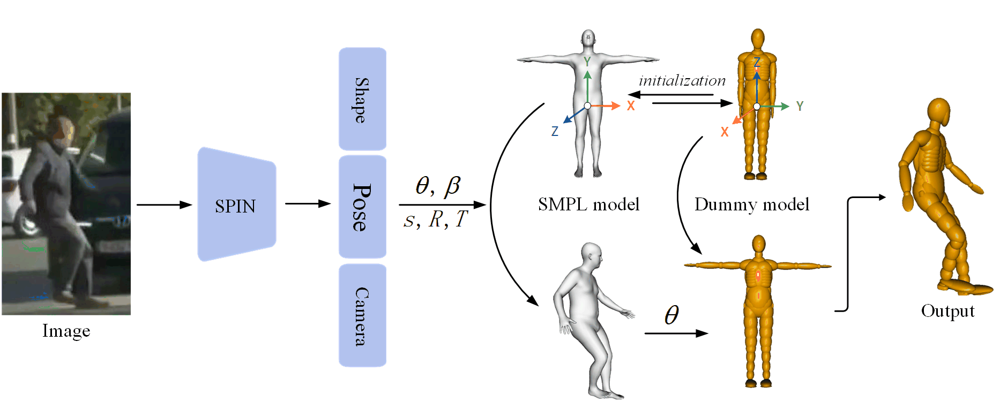

# MBPR: Multi_Body_Pose_Reconstruction
[English](README.md) | 简体中文

**Paper**：Real-time simulation reconstruction of pedestrian emergency posture in collision accident from monocular images

# 1.Shoulders Of Giants：

[1] [SMPL](https://smpl.is.tue.mpg.de/)：一种参数化人体模型

[2] [SPIN](https://www.seas.upenn.edu/~nkolot/projects/spin/)：三维人体重建方法

[3] [human_model_viewer](https://github.com/Lemon-XQ/human_model_viewer)：SMPL参数的调整可视化 

[4] [SMPL_Tools](https://github.com/wmj142326/SMPL_Tools)：这是在[human_model_viewer](https://github.com/Lemon-XQ/human_model_viewer)的基础上，我们开发的一款针对[SMPL](https://smpl.is.tue.mpg.de/)的标注工具

# 2.Pipline



# 3.Tutorial

0. 下载：`git clone https://github.com/wmj142326/MBPR`

1. 按照[SPIN/README.md](https://github.com/wmj142326/MBPR/tree/master/SPIN#readme)中的教程配置环境；

2. 运行`estimation.py`, 在

   ```python
   python estimation.py --checkpoint=data/model_checkpoint.pt --img_file=input_img/01 --outfile=out/01
   ```
   
   > input_img/01是一个存放输入图片的文件夹
   > out/01是一个存放输出结果的文件夹，包括：pic_outfile, pic_outfile_shape, pkl_outfile

3. 复制文件：

   madymo/images == input_img/01;

   madymo/pkl_file == out/pkl_outfile;

4. 运行`ped_pkl2xml.py`：

   ```python
   python ped_pkl2xml.py
   ```

5. 输出结果保存在文件夹：`madymo/xml_file/`

6. 可视化：将`madymo/xml_file/*.xml`导入MADYMO软件查看。

# 4.Appendix

在madymo/mesh/文件夹中，我们提供了SMPL的.obj结果,可通过[SMPL_Tools](https://github.com/wmj142326/SMPL_Tools)中的方法获得，需要将`.pkl`文件转换为`.ini`文件：
   ```python
python ped_pkl2ini.py
   ```
🎉 我们的工作已经被IEEE TITS录用啦!